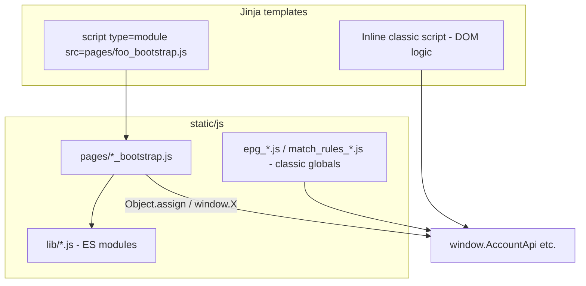

# Consistent ES module bootstrap pattern

## Problem

Four templates use inline `<script type="module">` only to `import` from [`static/js/lib/`](static/js/lib/) and attach APIs to `window` for legacy inline/classic scripts. ESLint’s HTML pipeline uses global `sourceType: 'script'` ([`.eslintrc.js`](.eslintrc.js)), so inline `import` fails unless the block is skipped with `<!-- eslint-disable-next-script -->` — which disables **all** linting for that block.

The target pattern already exists on Preview Channels:

```121:121:templates/preview_channels.html
<script type="module" src="/static/js/preview_channels_page.js"></script>
```

`eslint-plugin-html` does not lint `src` scripts ([`extract.js`](node_modules/eslint-plugin-html/src/extract.js) skips `attrs.src`), so external modules avoid the parse error without disable comments.

## Target architecture



**Conventions (document in a short `docs/FRONTEND_JS.md` or comment block in `.eslintrc.js`):**

| Role | Location | Loaded as |
|------|----------|-----------|
| Reusable API/helpers | `static/js/lib/*.js` | ES module (`import`/`export`) |
| Page bridge (attach libs to `window`) | `static/js/pages/{page}_bootstrap.js` | `<script type="module" src="{{ url_for(...) }}">` |
| Full page logic (optional, preferred long-term) | `static/js/pages/{page}.js` | module `src` only; no large inline script |
| Legacy EPG/match-rules bundles | existing `static/js/epg_*.js` etc. | classic `<script src>` (unchanged in this plan) |

Use **`url_for('static', filename='js/pages/...')`** in templates (consistent with [`epg_management.html`](templates/epg_management.html) script tags), not hardcoded `/static/...` (align [`preview_channels.html`](templates/preview_channels.html) when touched).

## Script load order (required)

Deferred module scripts run **after** a following **non-deferred** inline classic script runs. Pages that call `window.PpvApi` / `window.AccountApi` at **top-level** (e.g. [`ppv.html`](templates/ppv.html) lines 552–555, [`accounts.html`](templates/accounts.html) `loadAccounts()`) can race the bootstrap module.

**Rule for every migrated page:**

1. Bootstrap: `<script type="module" src="..._bootstrap.js"></script>`
2. Dependent inline script: either
   - `<script defer>` so it runs in document order with the module after parse, **or**
   - wrap top-level init in `document.addEventListener('DOMContentLoaded', ...)`

[`epg_management.html`](templates/epg_management.html) is already safe: inline init is inside `DOMContentLoaded` (line 1266).

## Phase 1 — Shared window bridges (dedupe)

Today **Settings** and **EPG Management** duplicate the same `EpgSyncProgress` setup (~15 lines each).

Add [`static/js/lib/install_epg_sync_progress.js`](static/js/lib/install_epg_sync_progress.js):

- `export function installEpgSyncProgressOnWindow()` — imports [`epg_sync_progress.js`](static/js/lib/epg_sync_progress.js) + [`epg_sync_progress_poll.js`](static/js/lib/epg_sync_progress_poll.js), assigns `window.EpgSyncProgress` (same shape as today).

Optional small test in `static/js/__tests__/install_epg_sync_progress.test.js` (mock `window`, assert keys exist).

## Phase 2 — Page bootstrap files and template updates

| Template | New file | Exposes on `window` |
|----------|----------|---------------------|
| [`accounts.html`](templates/accounts.html) | `static/js/pages/accounts_bootstrap.js` | `AccountApi` |
| [`ppv.html`](templates/ppv.html) | `static/js/pages/ppv_bootstrap.js` | `AccountApi`, `PpvApi` |
| [`settings.html`](templates/settings.html) | `static/js/pages/settings_bootstrap.js` | `EpgSyncProgress` (via installer), `PpvApi` |
| [`epg_management.html`](templates/epg_management.html) | `static/js/pages/epg_management_bootstrap.js` | `EpgSyncProgress` + datetime/helpers from lib (same `Object.assign(window, …)` as today) |

Template change pattern (each file):

- Remove `<!-- eslint-disable-next-script -->` and inline `<script type="module">…</script>`
- Add: `<script type="module" src="{{ url_for('static', filename='js/pages/…_bootstrap.js') }}"></script>`
- Fix init ordering (`defer` or `DOMContentLoaded`) where top-level calls use `window.*Api`

**Out of scope for this plan** (large follow-up): moving entire inline blocks from settings/accounts/ppv/rulesets into full `pages/*.js` modules. Only the import/bootstrap shim moves now.

## Phase 3 — ESLint coverage for ES modules

Today [`package.json`](package.json) only runs `eslint templates/**/*.html`. Module code in `static/js/lib/` is only exercised by Vitest.

Extend [`.eslintrc.js`](.eslintrc.js):

```js
overrides: [
  { files: ['*.html'], /* existing @html-eslint */ },
  {
    files: ['static/js/lib/**/*.js', 'static/js/pages/**/*.js'],
    parserOptions: { sourceType: 'module', ecmaVersion: 2020 },
    env: { browser: true, es2020: true },
    // reuse same rules as inline scripts where sensible
  },
]
```

Update npm scripts:

```json
"lint": "eslint templates/**/*.html static/js/lib static/js/pages"
```

**Do not** apply `sourceType: 'module'` to legacy classic bundles (`epg_common.js`, `match_rules_*.js`, etc.) — they remain non-module globals until a separate migration.

## Phase 4 — Verification

- `npm run lint` — no `eslint-disable-next-script` left for module imports
- `npm test` — existing Vitest suites + any new bridge test
- `make lint` — full Python + JS pipeline
- Manual smoke: Accounts (save + PPV visibility), PPV page (visibility + queue), Settings (PPV enrichment config + EPG progress table), EPG Management (datetime helpers + sync progress)

## Files touched (summary)

**New:** `static/js/pages/accounts_bootstrap.js`, `ppv_bootstrap.js`, `settings_bootstrap.js`, `epg_management_bootstrap.js`, `static/js/lib/install_epg_sync_progress.js`, `docs/FRONTEND_JS.md` (brief conventions)

**Edit:** four templates above, [`.eslintrc.js`](.eslintrc.js), [`package.json`](package.json) lint script; optionally [`preview_channels.html`](templates/preview_channels.html) for `url_for` consistency

**Remove:** all four `eslint-disable-next-script` comments tied to inline modules

## Future work (not in this PR)

- Migrate remaining large inline scripts to `static/js/pages/*.js` (Preview-style)
- Gradually convert `epg_*.js` / `match_rules_*.js` to modules instead of `window` bridges
- Consider dropping `window.*` bridges once callers import libs directly
