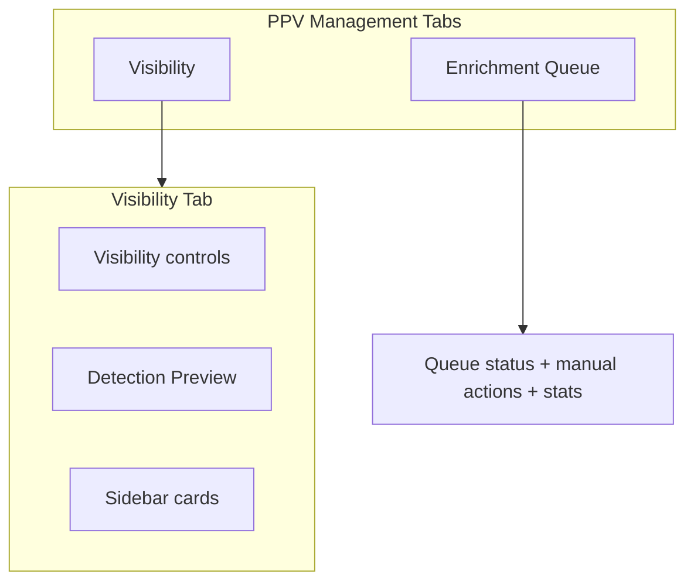

# PPV Management Page Restructure + Preview

## Page Structure (revised)

Reduce from three tabs to **two**:

| Tab | Label | Content |
|-----|-------|---------|
| 1 | **Visibility** (default) | Account visibility controls + detection preview panel |
| 2 | **Enrichment Queue** (renamed from "Queue Status") | Queue status, manual processing, statistics |

Remove the **Filtering** tab entirely. Its content becomes a concise sidebar card on the Visibility tab.



---

## Visibility Tab Layout

```
┌─────────────────────────────────────────────┬──────────────────┐
│  PPV Channel Visibility                     │  About Enrichment│
│  - per-account visibility dropdowns         │  (existing,      │
│  - visibility options info alert            │   tightened)     │
├─────────────────────────────────────────────┤                  │
│  Detection Preview (NEW)                    │  Filtering       │
│  [Account ▼]  [Events | Channels]  [↻]    │  (NEW concise)   │
│  summary pills · scrollable table           │                  │
│                                             │  Enrichment      │
│                                             │  Settings        │
└─────────────────────────────────────────────┴──────────────────┘
```

### Main column (`col-md-8`)

1. **Visibility card** — unchanged functionally; keep the info alert explaining the three visibility modes.
2. **Detection Preview card** — new (see below).

### Sidebar (`col-md-4`)

Consolidate three cards (drop verbose duplicate copy):

**1. About PPV Enrichment** — keep, lightly trimmed. One short paragraph on what enrichment does + bullet list of data added.

**2. Filtering** (replaces entire Filtering tab) — concise card:

- One sentence: filters on the [Filters](/filters) page include/exclude PPV channels by category or name; they combine with visibility settings above.
- Two bullets max: e.g. category filters for PPV categories; regex for event/sport names.
- Single **Go to Filters** button (`btn-sm btn-outline-success`).

Remove from sidebar/main: the 5-step quick start, duplicate warning alert, and filtering tips list from the old tab.

**3. Enrichment Settings** — unchanged (read-only rate-limit info from `/api/ppv-enrichment/settings`).

---

## Detection Preview Panel

Same behavior as prior plan iteration:

- **Account dropdown**: "All accounts" + per-account entries; auto-select account when its visibility dropdown changes.
- **Events | Channels** pill toggle in card header.
- **Summary pills**: Matched · Queued · No Match · Error (from API `summary`).
- **Scrollable table** (~400px max-height) with expandable row detail.
- **Visibility impact indicators** (eye/eye-slash or muted rows) based on selected account's current mode, using [services/ppv/visibility.py](services/ppv/visibility.py) rules.

Lazy-init on Visibility tab load.

---

## Enrichment Queue Tab

Rename only — content stays functionally the same:

- Tab button: `Enrichment Queue` (icon: `bi-hourglass-split` or `bi-arrow-repeat`)
- Tab id/target: keep `#queue-section` internally or rename to `#enrichment-queue-section` for clarity (update JS selectors if renamed)
- Card header: "Enrichment Queue" (drop redundant "Status" suffix)
- Sidebar "About Queue" card: unchanged

No backend changes for this tab.

---

## Backend: API Extensions

### 1. Extend `GET /api/ppv-epg/events`

Files: [routes/ppv_epg.py](routes/ppv_epg.py), [services/ppv/epg.py](services/ppv/epg.py)

- Query params: `mode` (`upcoming` | `past` | `all`), `account_id`, `status`, `data_completeness`, `search`, `page`, `per_page`
- Response includes pagination + summary counts
- Richer fields: `data_completeness`, images, `external_id`, `title`, `last_updated_at`
- Fix `mode=all` (currently returns 400 without `account_id`)

### 2. Add `GET /api/ppv-epg/events/<id>`

Full event + linked channels for expandable detail.

### 3. Add `GET /api/ppv-enrichment/channels`

File: [routes/ppv_enrichment.py](routes/ppv_enrichment.py)

- Query params: `account_id`, `status`, `search`, `page`, `per_page`
- Per-channel enrichment status + linked event summary
- Top-level summary counts by status

Shared `_serialize_event_summary()` helper.

---

## Frontend API Helpers

Extend [static/js/lib/ppv_api.js](static/js/lib/ppv_api.js):

- `fetchPpvEvents(params)`
- `fetchPpvEventDetail(id)`
- `fetchPpvEnrichmentChannels(params)`

Tests in [static/js/__tests__/ppv_api.test.js](static/js/__tests__/ppv_api.test.js).

Page logic stays inline in [templates/ppv.html](templates/ppv.html).

---

## Files to Change

| File | Changes |
|------|---------|
| [templates/ppv.html](templates/ppv.html) | Remove Filtering tab + section; rename Queue tab; sidebar filtering card; preview panel; preview JS |
| [static/js/lib/ppv_api.js](static/js/lib/ppv_api.js) | New fetch helpers |
| [routes/ppv_epg.py](routes/ppv_epg.py) | Extended events list + event detail route |
| [services/ppv/epg.py](services/ppv/epg.py) | `list_ppv_events()`, serializers |
| [routes/ppv_enrichment.py](routes/ppv_enrichment.py) | Channels preview route |

---

## Tests

| Area | File |
|------|------|
| Events list filters/pagination | [tests/ppv/test_epg.py](tests/ppv/test_epg.py) |
| Event detail endpoint | same |
| Channels preview endpoint | [tests/test_ppv_enrichment_routes.py](tests/test_ppv_enrichment_routes.py) |
| API URL helpers | [static/js/__tests__/ppv_api.test.js](static/js/__tests__/ppv_api.test.js) |

---

## Out of Scope

- Filtering tab (removed; sidebar link only)
- XMLTV preview
- Inline re-queue / manual match editing
- Live channel-name extraction preview
