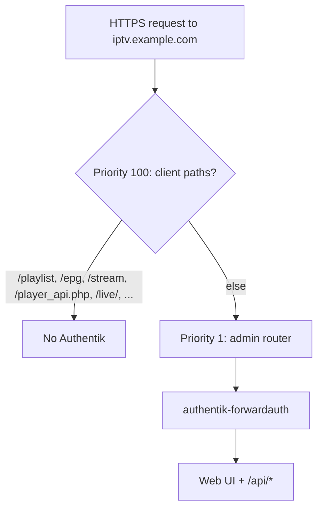

# Admin Authentication and Deployment Security

**Audit:** Application-wide audit, June 2026  
**Status:** Approved model (June 2026 clarification)

## Security model

IPTV Proxy v2 is an **administrative application**. The Flask app does not implement admin login (`POST /login` does not exist).

**Admin authentication is provided by the deployment stack:**

- **Traefik** — reverse proxy, TLS, routing
- **Authentik** — forward-auth middleware (`authentik-forwardauth@file`)

Reference implementation: **[klopstack](https://github.com/klopstack/klopstack)** (`../klopstack` from this repo). Full labels and path rules: **[DEPLOYMENT.md](../DEPLOYMENT.md)**.

## Traefik routing (klopstack pattern)

On host `iptv.${CLOUDFLARE_DNS_ZONE}`, two routers share the `iptv-proxy-v2` service:



| Router | Priority | Middleware | Paths |
|--------|----------|------------|-------|
| `iptv-streams` | 100 | `security-headers@file` | Client prefixes only (see DEPLOYMENT.md) |
| `iptv-proxy-v2` | 1 | `authentik-forwardauth@file`, `security-headers@file` | Everything else on the host |

Authentik itself is served at `auth.${CLOUDFLARE_DNS_ZONE}` **without** forward-auth on its router (otherwise other apps cannot complete OAuth/forward-auth).

Forward-auth address (klopstack `traefik-dynamic.yaml`):

```
http://authentik:9000/outpost.goauthentik.io/auth/traefik
```

## Endpoint classes

| Class | Examples | Auth mechanism |
|-------|----------|----------------|
| **Admin** | `/`, `/settings`, `/api/accounts`, `/api/ppv-enrichment/*` | Traefik + Authentik |
| **Xtream client** | `/player_api.php`, `/live/<user>/<pass>/...` | Provisioned Xtream credentials |
| **EPG / playlist delivery** | `/playlist/...`, `/epg/...` | URL/account scoping + Xtream or config tokens |

## Gluetun port `8889` (klopstack)

The `8889:8000` mapping on the **gluetun** service is a host port forward into Gluetun’s network namespace. It only exposes iptv-proxy **without** Traefik if the app uses `network_mode: service:gluetun` (SAB/qBittorrent pattern). **Current klopstack `iptvproxy` uses `mediastack` instead**, so admin traffic should go through Traefik + Authentik; `8889` is not a separate “VPN UI” for remote VPN clients. See [DEPLOYMENT.md](../DEPLOYMENT.md#gluetun-and-port-8889-often-misunderstood).

## What the app does not do

- Flask-Login, session cookies for admin, or API keys on `/api/*`
- Per-route `@login_required` (by design)

## Deployment hardening (still recommended)

| Item | Reference |
|------|-----------|
| Traefik labels + path split | [DEPLOYMENT.md](../DEPLOYMENT.md) |
| `.dockerignore`, `SECRET_KEY` | TODO 84 |
| FCC reset over HTTP → CLI only | TODO 69 |
| `/icon/fetch` SSRF allowlist | TODO 69 |

## Related TODOs

- **68** — document proxy model (DEPLOYMENT.md)
- **69** — app-level hardening (not Flask auth)
- **84** — Docker/secrets
