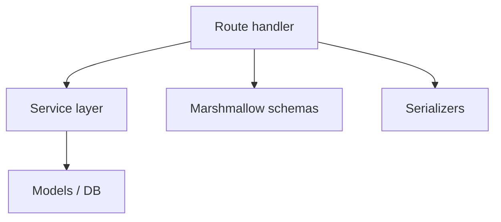

# API Layer and Fat Routes

**Audit:** Application-wide audit, June 2026  
**Status:** Draft for review

## Problem

Business logic lives in route handlers instead of services. Several modules exceed 500–1,500 lines.

## Largest route modules

| Module | Lines | Primary concerns |
|--------|-------|------------------|
| `epg/match_rules.py` | ~1500 | CRUD, preview, rematch, serialization |
| `accounts.py` | ~1358 | Accounts, credentials, categories, channels, sync triggers |
| `config_transfer.py` | ~1075 | Export/import entire configuration |
| `epg/channels.py` | ~1025 | EPG channel mapping, matching UI backend |
| `fcc_match_patterns.py` | ~930 | 8 entity CRUD + reset-defaults hack |
| `xtream.py` | ~869 | Client API + admin credential CRUD mixed |
| `streams.py` | ~758 | Stream proxy admin |
| `api.py` | ~696 | Sync triggers, scheduler, misc |

## Antipatterns observed

1. **Inline DB queries** in handlers
2. **Duplicate serializers** across FCC, config export, match rules
3. **Side-effect GET** — account categories fetches upstream provider
4. **Mixed concerns on blueprint** — Xtream client + admin credentials
5. **Dead blueprint** — `account_epg_channels_bp` registered, zero routes
6. **Inconsistent validation** — schemas on some routes, manual checks on others

## Target layering

Routes: parse request → validate schema → call service → serialize response.

## Blueprint organization issues

- Some use `url_prefix="/api/epg"`; others embed full path in each `@route`
- 22+ blueprints registered inline in `app.py` — no `register_routes(app)` helper
- PPV config under `/api/settings` vs `/api/ppv-enrichment/*`

## Phased refactor plan

See TODO 78 (split fat routes) and TODO 79 (shared serializers).

Priority order:

1. `accounts.py` — highest churn, side-effect GET
2. `fcc_match_patterns.py` — shared with config export
3. `epg/match_rules.py` — service layer partially exists
4. `config_transfer.py`

## Related TODOs

- **72**, **73**, **74**, **75**, **78**, **79**
- **68** — document proxy auth; **69** — destructive endpoint hardening
