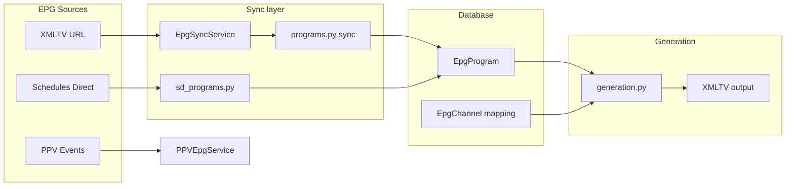

# EPG Service Layer Architecture

**Audit:** Application-wide audit, June 2026  
**Status:** Draft for review

## Module map

| Module | Lines | Responsibility |
|--------|-------|----------------|
| `epg/programs.py` | ~1135 | Sync + query + XMLTV — **should split** |
| `epg/generation.py` | ~865 | DB-first XMLTV; legacy URL fetch paths |
| `epg/sd_programs.py` | ~660 | Schedules Direct program sync |
| `epg/fcc/matching.py` | ~616 | FCC call sign matching |
| `epg/match_rules/` | ~400+ | EPG channel auto-matching (mixins) |
| `epg_sync_service.py` | ~409 | Per-source sync entry |
| `epg_sync_orchestrator.py` | ~338 | Bulk sync, locks, progress |

## Data flow

## Technical debt

### programs.py monolith

Should split into sync / repository / export (TODO 90).

### Duplicate program persistence

`programs.py` and `sd_programs.py` share nearly identical create/update — extract shared module (TODO 76).

### Legacy generation paths

`generation.py` header says DB-first, no external calls during generation, but retains:

- `fetch_epg_from_source` (URL fetch on cache miss)
- `filter_epg_by_channels`
- Full XML filter/generate

**Action:** Audit call sites; move to `generation/legacy_xml.py` or remove (TODO 90).

### Match rules + visibility bug

EPG auto-matching uses stale `is_visible` — see `channel-visibility-is-visible.md` (TODO 70).

### Weak direct tests

- `fcc/matching.py` — mostly indirect via route tests
- `coverage.py` — mocked in route tests
- `SdLineupSyncProgress` — no unit tests

## Match rules mixin stack

`EpgMatchRulesService` uses 6 mixins — manageable but navigation-heavy. Consider flat service + strategy objects if growing further.

## Related TODOs

- **70**, **76**, **90**
- Completed EPG sync: **40–51**
