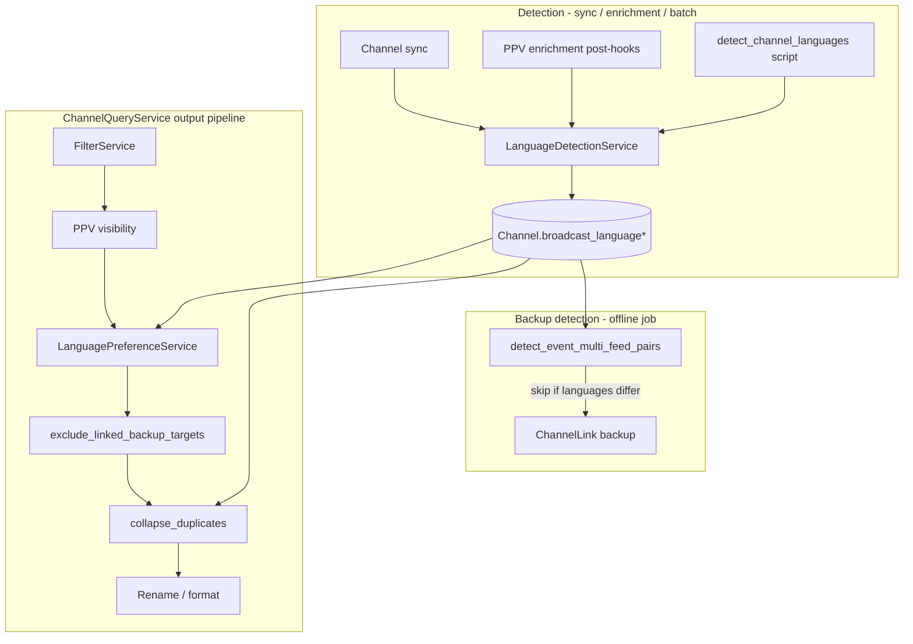

# Language and Country Preferences

**Audit:** Language preference plan review, June 2026  
**Status:** Draft for review  
**Related plan:** *Language Preference Support* (Cursor plan `language_preference_support_6408324e`) — Phase 1 MVP scope

## Context

IPTV providers often expose **multiple channel rows for the same PPV event** — for example Peacock 098 (English) and Peacock 099 (Español) for the same MLB game. Matching correctly links both channels to one calendar event, but the output pipeline has no way to pick a feed aligned with the viewer's language preference. Backup pairing and quality collapse can hide the wrong stream arbitrarily.

**Phase 1 MVP** (defined in the plan above) establishes the foundation:

| Deliverable | Summary |
|-------------|---------|
| **Schema** | `Channel.broadcast_language`, `language_source`, `language_confidence`; `XtreamCredential.preferred_languages`, `language_fallback` |
| **Detection** | Name-pattern resolver + seeded network defaults (Peacock, beIN, DAZN, etc.) at sync/enrichment time |
| **Output** | `LanguagePreferenceService` — per event group, keep one feed matching `preferred_languages`; hide others (MVP default) |
| **Pipeline fixes** | Skip cross-language backup pairing; include `broadcast_language` in `collapse_duplicates` grouping key |
| **UI** | Xtream credential language prefs; PPV event detail language badges |

**MVP success criterion:** A credential with `preferred_languages: ["en"]` receives only the English Peacock feed for a multi-language event, not both.

This document covers **post-MVP** work: broader detection, operator tooling, EPG alignment, country/region preferences, and long-tail language features. It assumes Phase 1 ships first.

---

## Goals and non-goals

### Goals (post-MVP)

- Improve **detection coverage** without sacrificing confidence tracking (source + score on every assignment).
- Give **operators** configurable rules, overrides, and batch backfill — not just hard-coded Peacock patterns.
- Align **EPG and Xtream metadata** with detected broadcast language where data exists.
- Introduce **country/region preference** as an orthogonal axis, combinable with language scoring.
- Preserve the Phase 1 principle: **choose between channel rows**, never swap in-stream audio tracks.

### Non-goals

- In-stream alternate audio track selection (HLS `#EXT-X-MEDIA`, DASH AdaptationSet) — client/player responsibility.
- Auto-transcoding, dubbing, or on-the-fly language switching.
- ML/spoken-language identification from raw audio content.
- Replacing existing tag-based country filters — extend them, don't duplicate.

---

## Phase 2 — Detection breadth and operator tools

### Detection breadth

Extend `LanguageDetectionService` beyond Phase 1 explicit patterns and inline network seeds:

| Layer | Phase 1 | Phase 2 |
|-------|---------|---------|
| Explicit name tokens | `(Español)`, `[EN]`, common sports suffixes | Same; expand from operator feedback |
| Tag rules | — | Configurable via `TagRule` extensions |
| Network defaults | Hard-coded seed map | `NetworkLanguageDefault` table + admin CRUD |
| Country/category heuristics | — | Conservative; never `ES:` → `es` without explicit marker or network rule |
| ffprobe | — | Deferred to Phase 3 |

**Region ≠ language:** Existing `US:` / `ES:` prefix handling in `services/ppv/extraction/patterns.py` and `COUNTRY_PREFIX_TZ` in `services/ppv/constants.py` infers **feed region and timezone**, not spoken language. Phase 2 country heuristics must document this distinction in admin UI help text and never globally map `ES:` to Spanish.

### Operator tools

| Tool | Purpose |
|------|---------|
| **Tag rules for language** | Match channel/category patterns → set `broadcast_language` (and optional `lang:*` tag) |
| **NetworkLanguageDefault admin** | CRUD for provider/network → default ISO 639-1; lower priority than explicit name match |
| **Channel detail override** | `PUT /api/channels/{id}/broadcast-language` — `language_source=manual`, confidence 1.0 |
| **Batch backfill** | `python -m scripts.detect_channel_languages [--account-id N] [--dry-run]` — re-run detection on existing rows |
| **PPV admin badges** | (MVP) Show language per linked channel; Phase 2 adds override affordance on channel preview |

### Account and playlist config preferences

Phase 1 wires language preference from **XtreamCredential** only. Phase 2 extends:

| Surface | Fields | Notes |
|---------|--------|-------|
| `Account` | `preferred_languages`, `language_fallback` | Default for bare M3U account URLs |
| `PlaylistConfig` | Same columns | Per-config M3U URLs (mirror Xtream credential model) |
| M3U query param | `?preferred_lang=en,es` | Optional stateless override for shareable URLs |

Preference resolution order (proposed): query param → `PlaylistConfig` → `XtreamCredential` → `Account` default → `["en"]`.

---

## Phase 3 — Stream probe and EPG alignment

### ffprobe audio language

Extend `ChannelHealthService._analyze_stream_with_ffprobe()` (today counts audio streams only) to inspect:

- Primary audio stream `tags.language` (ISO 639-2/639-1 normalization)
- Subtitle stream languages (secondary signal, lower confidence)

Store probe results on channel as JSON metadata (see [Data model evolution](#data-model-evolution)). Detection resolver uses ffprobe only when name/tag/network/country layers return unknown, with confidence capped (~0.7) unless a single unambiguous audio track exists.

**Operational note:** ffprobe runs are expensive. Phase 3 should gate on:

- Channels with `broadcast_language IS NULL` or `language_source IN ('country_default', 'network_default')` and low confidence
- Optional admin-triggered "probe language" on channel health page
- Rate limiting via existing health-check scheduler, not per-playlist-request

### Schedules Direct `broadcast_language`

`EpgChannel.broadcast_language` (JSON array string) is populated during SD sync in `routes/epg/common.py` but **never read downstream**. Phase 3:

1. When an IPTV channel maps to an FCC/SD EPG row, copy primary SD language onto `Channel.broadcast_language` if channel language is still unknown (source `sd_epg`, confidence ~0.8).
2. Prefer SD language over country heuristics, below explicit name/tag/manual.

### EPG / Xtream output alignment

| Output | Today | Phase 3 |
|--------|-------|---------|
| Xtream EPG listings (`routes/xtream.py`) | Hardcoded `"lang": "en"` | Emit `channel.broadcast_language` or credential primary lang |
| PPV XMLTV (`services/ppv/epg/xmltv.py`) | `lang="en"` on title/desc/category | Per-programme lang from linked channel |
| PPV EPG channel ID | `ppv-event-{external_id}` for all feeds | Optional suffix `ppv-event-{id}-{lang}` when multiple languages shown |

Separate EPG channel IDs are **optional** — only needed if clients show all language feeds simultaneously (`show_all` mode) and require distinct guide rows.

---

## Future language features

These build on stable `broadcast_language` metadata and Phase 1 preference plumbing. Ordered by suggested priority after Phase 3.

| Feature | Description | Depends on |
|---------|-------------|------------|
| **Ordered multi-language** | Full `preferred_languages` list scoring (Phase 1 stores list; MVP may only expose single primary) | Phase 1 |
| **`show_all` credential mode** | `language_fallback: "show_all"` — list every language feed; no event-group hiding | Phase 1 fallback enum |
| **`{language}` rename token** | Extend `ppv_rename_format` / FCC rename formats — e.g. `{home_team} vs {away_team} ({language})` | Detection + rename pipeline |
| **Language-aware filters** | Tag rules emitting `lang:es`; filter rules `include_tags: ["lang:es"]` via existing `FilterService` | Tag rules (Phase 2) |
| **Confidence-gated auto-hide** | Hide `und` only when a confident alternative exists in the same event group | Phase 1 + confidence field |
| **EPG title translation dedup** | Schedules Direct xref API (`services/schedules_direct.py` `xref` endpoint) to detect duplicate programme translations | Phase 3 EPG work |

### `{language}` token behavior (proposed)

- Render ISO 639-1 code uppercased (`EN`, `ES`) or configurable locale display name map.
- When `broadcast_language` is `und`/null, omit token segment or render empty per format string rules (document in PPV rename help).

### `show_all` vs hide-non-preferred

| Mode | Playlist | Backup pairing | Collapse |
|------|----------|----------------|----------|
| Hide (MVP default) | One feed per event group | Cross-language pairs skipped | Language in group key |
| Show all | All feeds listed | Cross-language pairs skipped | Language in group key |
| Hide + confidence gate | Hide weak `und` when alt exists | Same | Same |

---

## Future country and region features

Country preference is **orthogonal to language** and partially exists via tag filters (`include_tags: ["US"]` on `PlaylistConfig`).

| Feature | Description |
|---------|-------------|
| **`preferred_countries`** | Ordered ISO 3166-1 alpha-2 list on credential/account/config — prefer `US:` feed over `UK:` for same event |
| **Combined scoring** | Lexicographic or weighted score: `(country_rank, language_rank, match_confidence, quality)` — e.g. `US+en` beats `US+es` beats `MX+es` |
| **Existing tag filters** | Keep as primary curation mechanism; `preferred_countries` applies at event-group selection like language |
| **Timezone vs country** | `ppv_rename_timezone` and `COUNTRY_PREFIX_TZ` remain separate — timezone affects rename/display; country affects feed selection |

### Country detection sources (proposed)

Reuse existing signals before new heuristics:

1. Channel name prefix (`US:`, `UK:`) via `COUNTRY_PREFIX_RE`
2. Tags from tag rules (`US`, `UK`, etc.)
3. `EventChannelLink.region` / `provider` (PPV metadata, not ISO country — map via lookup table)
4. Category name prefix patterns

Store inferred country on channel as `broadcast_country` (nullable, ISO alpha-2) with `country_source` mirroring language provenance fields — **Phase 4+**, not Phase 2, to avoid scope creep.

---

## Explicitly out of scope

| Item | Rationale |
|------|-----------|
| In-stream audio track selection | Requires player support; separate channel rows are the IPTV provider model |
| Auto-transcoding / dubbing | Infrastructure and licensing complexity |
| ML spoken-language ID | Cost, accuracy, latency; ffprobe tags sufficient for most IPTV |
| Inferring language from `ES:` region prefix alone | Spain region ≠ Spanish audio; documented anti-pattern |
| Replacing `FilterService` with preference service | Complementary layers — filters curate pool; preferences disambiguate duplicates |

---

## Data model evolution

### Phase 1 (MVP baseline)

Already specified in the plan — required dependency for all post-MVP work.

### Phase 2 additions

**`network_language_defaults` table (`NetworkLanguageDefault`):**

| Column | Type | Purpose |
|--------|------|---------|
| `id` | PK | |
| `name` | string | Admin label, e.g. "Peacock PPV slots" |
| `pattern` | string | Channel name regex or contains pattern |
| `pattern_type` | enum | `regex`, `contains`, `prefix` |
| `network_tag` | string nullable | Optional match on existing tag (e.g. provider tag) |
| `default_language` | string(10) | ISO 639-1 |
| `priority` | int | Lower runs first among network rules |
| `enabled` | bool | |
| `account_id` | FK nullable | Null = global; set for account-specific overrides |

**Tag rule extension (option A — preferred):** Add optional columns to `TagRule`:

| Column | Purpose |
|--------|---------|
| `set_broadcast_language` | ISO 639-1 or null (no language action) |
| `set_language_confidence` | Default 0.9 for tag-derived rules |

Option B: dedicated `LanguageTagRule` model — cleaner separation but duplicates ruleset UI.

**Account / PlaylistConfig (Phase 2):**

| Column | Type | Default |
|--------|------|---------|
| `preferred_languages` | JSON text | `["en"]` |
| `language_fallback` | string | `"unknown"` |

### Phase 3 additions

**Channel probe metadata** — add JSON text column `stream_probe_metadata`:

```json
{
  "probed_at": "2026-06-03T12:00:00Z",
  "audio_languages": [{"code": "eng", "iso639_1": "en", "index": 0, "default": true}],
  "subtitle_languages": [{"code": "spa", "iso639_1": "es"}],
  "primary_audio_language": "en"
}
```

Detection service reads `primary_audio_language` when resolving ffprobe layer.

**Optional denormalization:** `EventChannelLink.language` — copy of `Channel.broadcast_language` at link time for faster event-group queries without join. Prefer join through `Channel` unless profiling shows bottleneck; if added, keep in sync via enrichment post-hook.

### Phase 4+ (country)

| Column | Model | Purpose |
|--------|-------|---------|
| `broadcast_country` | `Channel` | ISO alpha-2 |
| `country_source` | `Channel` | Same enum pattern as `language_source` |
| `preferred_countries` | Account / Credential / PlaylistConfig | Ordered JSON list |

---

## API and UI surface area

### Admin API (new / extended)

| Endpoint | Phase | Purpose |
|----------|-------|---------|
| `GET/POST/PUT/DELETE /api/network-language-defaults` | 2 | CRUD for network defaults |
| `PUT /api/channels/{id}/broadcast-language` | 2 | Manual override `{ language, source: "manual" }` |
| `POST /api/channels/detect-languages` | 2 | Batch trigger (or CLI-only initially) |
| `GET /api/channels/{id}/stream-probe` | 3 | On-demand ffprobe language probe |
| Tag rules API | 2 | Extend create/update schemas with `set_broadcast_language` |

### Credential / account UI

| Location | Phase | Controls |
|----------|-------|----------|
| `templates/xtream.html` | 1 | Preferred languages, fallback mode |
| Account settings / playlist config | 2 | Same fields for M3U paths |
| `templates/ppv.html` event detail | 1–2 | Language badges; override link to channel |
| `static/js/preview_channels_page.js` | 2 | Language column + inline override |
| Network defaults admin | 2 | New tab or extend `fcc_match_patterns` patterns UI |
| Tag rules UI | 2 | "Set broadcast language" field on rule form |

### Batch operations

```bash
# Phase 2 backfill
python -m scripts.detect_channel_languages [--account-id ID] [--dry-run] [--force]

# Phase 3 optional probe pass
python -m scripts.probe_channel_languages [--account-id ID] [--limit N]
```

---

## Pipeline integration points



### ChannelQueryService

Insert `LanguagePreferenceService.select_preferred_channels()` **after** PPV visibility, **before** backup exclusion and collapse (Phase 1):

```
filters → ppv_visibility → language_preference → exclude_backups → collapse_duplicates → rename
```

Phase 4 adds optional `country_preference` immediately after language (or merged scoring in one service).

Wire preferences from credential/account/config in:

- `channels_for_xtream()` — `routes/xtream.py`
- `channels_for_playlist_config()` / `channels_for_account()` — M3U paths
- Preview endpoints — respect same prefs when simulating client output

### Backup pairing

`detect_event_multi_feed_pairs()` in `services/backup_pair_detection.py` must skip pairs where `broadcast_language` differs. Same-language multi-feeds continue to pair by quality score.

### Collapse

`QualityService.collapse_duplicates()` grouping key becomes composite: `(cleaned_name, broadcast_language)` (and existing EPG mapping secondary group). Prevents EN/ES collapse when names normalize identically.

### EPG / XMLTV

| Consumer | Integration |
|----------|-------------|
| PPV EPG generation | Read language from linked channel; optional per-lang channel IDs |
| FCC/SD mapped channels | Backfill language from `EpgChannel.broadcast_language` |
| Xtream `get_short_epg` / `get_simple_data_table` | Replace hardcoded `"lang": "en"` |
| EPG match rules | No change to matching; optional future filter by language tag |

---

## Risks, mitigations, and open questions

### Risks

| Risk | Impact | Mitigation |
|------|--------|------------|
| Wrong default language (no name marker) | User sees wrong feed or hidden feed | Conservative network defaults; `language_fallback: "show_all"` escape; manual override |
| Hiding the only available feed | Black screen / missing event | If all feeds fail preference match, fall back to highest-confidence feed or show_all |
| Region conflated with language | Systematic mis-detection for `ES:` feeds | Never infer language from region prefix alone; document in UI |
| ffprobe cost / latency | Health scheduler overload | Opt-in batch probe; rate limits; skip channels with confident name detection |
| Stale language after rename | Wrong preference until re-detection | Re-run detection on channel name change (sync hook); backfill command |
| Event link join cost | Slow playlist generation | Batch-load `EventChannelLink` once per query (same pattern as backup detection) |
| SD language ≠ IPTV stream language | EPG/lang mismatch | Prefer ffprobe over SD when both exist; expose source in admin |

### Open questions (decision needed)

| # | Question | Options | Recommendation |
|---|----------|---------|----------------|
| 1 | Tag rule extension vs separate language rules model | Extend `TagRule` / new model | Extend `TagRule` — reuse ruleset UI and priority ordering |
| 2 | Store language on `EventChannelLink`? | Denormalize / join only | Join only until perf data; add denormalized column if needed |
| 3 | Account-level vs credential-level defaults for M3U | Account default + config override | Config override → account default → `["en"]` |
| 4 | Separate EPG IDs per language feed | Single ID / suffixed IDs | Single ID for hide mode; suffixed IDs only when `show_all` + client testing warrants |
| 5 | Country preference phase timing | Phase 2 lite / Phase 4 dedicated | Phase 4 — complete language detection first |
| 6 | `{language}` token display | ISO code / locale name | ISO upper code default; optional `{language_name}` token later |
| 7 | Probe metadata column vs reuse health JSON | New column / extend health | New `stream_probe_metadata` — health and language lifecycles differ |

---

## Dependencies on Phase 1 MVP

Post-MVP work **must not** ship before Phase 1 provides:

| Dependency | Why |
|------------|-----|
| `Channel.broadcast_language*` columns | All detection layers write here |
| `LanguageDetectionService` skeleton | Phase 2/3 extend resolver chain, not replace |
| `LanguagePreferenceService` + CQS hook | Country scoring extends same insertion point |
| Backup/collapse fixes | Cross-language feeds must not pair/collapse before country layer adds more variants |
| Xtream credential UI baseline | Account/config prefs mirror same fields |
| Test suite (`tests/test_language_preference.py`) | Regression guard for Peacock EN/ES disambiguation |

---

## Suggested implementation order

### Milestone 1 — Phase 1 MVP (prerequisite)

Ship plan todos: schema, detection (name + seeds), preference service, pipeline fixes, Xtream UI, PPV badges, tests.

**Exit:** Peacock EN/ES integration test green; backup/collapse regressions pass.

### Milestone 2 — Operator detection (Phase 2a)

1. `NetworkLanguageDefault` table + admin CRUD API/UI  
2. Tag rule language columns + ruleset processing in `TagService`  
3. `PUT /api/channels/{id}/broadcast-language` manual override  
4. `scripts.detect_channel_languages` backfill  

**Exit:** Operator can fix mis-detected channel without code deploy.

### Milestone 3 — Config breadth (Phase 2b)

1. `preferred_languages` / `language_fallback` on `Account` and `PlaylistConfig`  
2. M3U query param override  
3. Channel preview language column  

**Exit:** Non-Xtream M3U URLs respect language preference.

### Milestone 4 — EPG language (Phase 3a)

1. SD `broadcast_language` → channel backfill for mapped FCC channels  
2. Xtream EPG `lang` field from channel metadata  
3. PPV XMLTV `lang` attributes from linked channel  

**Exit:** Guide language matches playlist selection for PPV and FCC channels.

### Milestone 5 — Stream probe (Phase 3b)

1. `stream_probe_metadata` column  
2. ffprobe language extraction in health service  
3. `scripts.probe_channel_languages` gated batch job  

**Exit:** Unknown-language channels gain probe-derived language with confidence score.

### Milestone 6 — Future language UX (Phase 3c+)

1. Full ordered multi-language scoring UX  
2. `{language}` rename token  
3. `show_all` mode testing across TiviMate / common clients  
4. Language tag filters (`lang:es`)  
5. Confidence-gated hide  

**Exit:** Bilingual household and power-user workflows documented in XTREAM_CODES_API / operator runbook.

### Milestone 7 — Country preference (Phase 4)

1. `broadcast_country` detection (prefix/tag/category)  
2. `preferred_countries` on credential/account/config  
3. Combined country+language scoring in preference service  
4. Tests for same-event US vs UK feed selection  

**Exit:** Regional feed disambiguation independent of language.

---

## Related files

| Area | Files |
|------|-------|
| Models | `models/channel.py`, `models/account.py`, `models/ppv.py`, `models/epg.py` |
| Detection | `services/language_detection_service.py` (new), `services/ppv/enrichment_post_hooks.py`, `services/tag_service.py` |
| Output | `services/language_preference_service.py` (new), `services/channel_query_service.py` |
| Pairing / collapse | `services/backup_pair_detection.py`, `services/quality_service.py` |
| EPG | `services/ppv/epg/xmltv.py`, `routes/xtream.py`, `routes/epg/common.py`, `services/schedules_direct.py` |
| Health / probe | `services/channel_health_service.py` |
| UI | `templates/xtream.html`, `templates/ppv.html`, tag rules / FCC patterns admin |
| Tests | `tests/test_language_preference.py` (new), extend `tests/test_xtream.py` |

---

## Related documentation

- [PPV Pipeline and Module Map](ppv-pipeline-and-module-map.md) — enrichment and output flow  
- [EPG Service Architecture](epg-service-architecture.md) — SD sync and XMLTV generation  
- [Channel Visibility and `is_visible`](channel-visibility-is-visible.md) — filter vs cached visibility (preference layer is separate)
