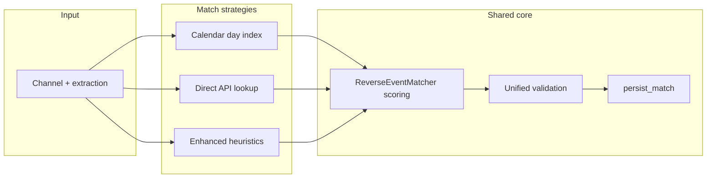

# PPV Matching Strategies

**Audit:** PPV audit, June 2026  
**Status:** Draft for review

## Problem statement

The codebase runs **three overlapping matching pipelines** without clear documentation of when each activates, what they share, and how to extend them. This causes duplicate calendar loads, divergent validation rules, and confusion about which path persists events.

---

## Pipeline comparison

| Aspect | Calendar enrichment (primary) | ReverseEventMatcher | EnhancedPPVMatcher (fallback) |
|--------|------------------------------|---------------------|-------------------------------|
| **Entry** | Orchestrator → `enrich_channels` | Called inside enrichment | `run_enhanced_fallback` |
| **Calendar source** | Scraper per UTC day | Same events, indexed | Prefetch + direct API |
| **Extraction** | `PPVEventExtractor` | Receives pre-extracted competitors | Own categorization |
| **Persistence** | Direct create/link (**bug: bypasses persist_match**) | N/A | `persist_enhanced_match` ✓ |
| **Confidence threshold** | Matcher-internal | Strategy-specific | 0.35 hard-coded |
| **Detail fetch queue** | Yes (TSDB IDs only) | N/A | Depends on match source |

---

## Calendar enrichment (production hot path)

1. Extract all channel names (`_extract_all_channels`).
2. Filter via `classify_ppv_enrichment` (skip placeholders, generic slots, far-future).
3. Group by inferred UTC calendar day (`channel_matching`).
4. Load calendar events for each day (TheSportsDB + MiLB via scraper).
5. Build reverse matcher index once per day.
6. Score each channel against day's events.
7. Persist match + queue detail fetch.

**Strengths:** No API rate limits on calendar scrape; batch-efficient index per day.

**Weaknesses:** Double classification/extraction (TODO 56); persistence bypass (TODO 54); detail queue assumes TheSportsDB IDs (TODO 55).

---

## ReverseEventMatcher

Standalone package under `services/reverse_event_matcher/`:

- `orchestrator.py` — loads events, runs strategies
- `match_strategy.py` — competitor, time, league scoring
- Own generic-channel check (duplicates `detection.is_generic_channel_name`)

Used **as a library** by calendar enrichment, not as the top-level orchestrator despite the name.

**Risk:** Post-match validation in `ppv/matching/validation.py` uses different normalization than strategies (TODO 58).

---

## Date extraction

Channel titles are parsed by **`PPVEventExtractor.extract_date()`** (enrichment, enrichability) and **`DateExtractor.extract_date()`** (reverse matching). Both use the same ordered strategy chain in `services/ppv/extraction/date_strategies/` and shared anchoring in `services/ppv/extraction/date_anchor.py`, with an injectable **reference datetime** (UTC “now” in production, pinned in tests).

**Precedence (first match wins):**

1. Parenthetical / pipe / inline ISO timestamps (`(2026-06-03 18:30:00)`, `start:…`)
2. European `DD/MM` (or `DD-MM`) with optional `am/pm`
3. Pipe weekday lines (`| Sat 03 Jan 17:15`)
4. Explicit anchors: `Jun 4 01:55`, `@ Jun 3 11:00 AM`, or `28 Dec 8:00pm`
5. Month/day without time (`Oct 18`, `December 28`)
6. Trailing clock time only → **reference calendar day** (e.g. `… 12:30pm` on 2026-06-03 → `2026-06-03 12:30`, no next-day rollover)
7. Guarded `dateparser` fallback for remaining natural-language fragments (only when the title has a plausible date signal)

**Year selection:** Month/day anchors pick the nearest occurrence within ±1 year of the reference; same calendar day as reference is preferred (so `@ Jun 3` on 2026-06-03 stays 2026, not 2027).

**Rejection:** Parses more than ~365 days beyond the reference, placeholder years (≥2098), or titles with no date signal return `None` (no spurious default date for boxing-style names).

---

## EnhancedPPVMatcher (fallback)

`services/ppv/matching/enhanced.py` (~690 lines):

- Sport categorization from channel name
- Calendar prefetch across accounts
- Can invoke reverse matcher OR direct TheSportsDB API
- Used for `no_match` retry and calendar warmup

**Architectural question:** Should enhanced matcher merge into calendar pipeline as a pluggable "strategy" rather than a parallel class with its own singleton?

---

## Recommended target architecture

1. **Single persistence gate:** all strategies → `persist_match`.
2. **Single validation module:** shared normalization with reverse matcher.
3. **Strategy registry:** calendar / API / enhanced register behind common interface.
4. **Orchestrator decides order:** calendar first, enhanced fallback on `no_match`.

---

## Decision log (to fill during review)

| Question | Options | Decision |
|----------|---------|----------|
| Keep EnhancedPPVMatcher separate? | Merge vs keep as fallback plugin | _TBD_ |
| Direct API in enhanced — still needed? | Remove if calendar coverage sufficient | _TBD_ |
| Confidence thresholds | Single constants module | Prefer `MIN_MATCH_CONFIDENCE` everywhere |

---

## Related TODOs

- 54, 56, 58, 65 — implementation
- 63 — integration tests with real matcher + fixtures
