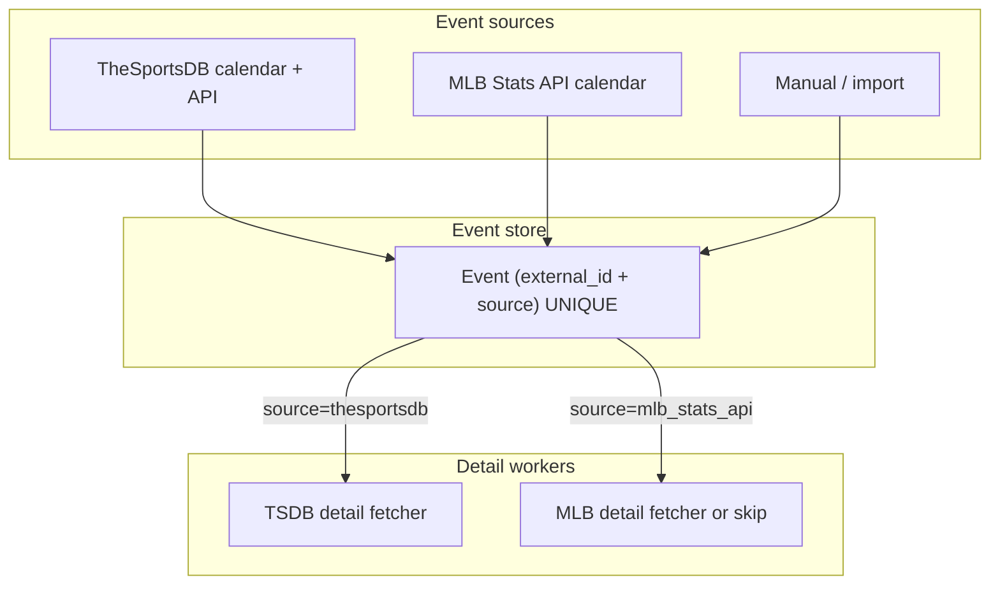

# PPV Multi-Source Events

**Audit:** PPV audit, June 2026  
**Status:** Draft for review

## Context

PPV events originally assumed a single source: **TheSportsDB**. Recent work added **MiLB via MLB Stats API** (`Event.SOURCE_MLB_STATS`), team location registry for fb/wnba/milb, and multi-league calendar scraping.

The data model and enrichment pipeline were not fully updated for multi-source semantics.

---

## Current state

### Event model

```python
SOURCE_THESPORTSDB = "thesportsdb"
SOURCE_MLB_STATS = "mlb_stats_api"
SOURCE_MANUAL = "manual"
SOURCE_IMPORT = "import"
```

| Field | Issue |
|-------|-------|
| `external_id` | `unique=True` on column alone — conflicts with per-source uniqueness |
| `source` | Correctly stored by `persistence.create_or_update_event` |
| Column comment | Still says "TheSportsDB event ID" |

### Persistence

`create_or_update_event` correctly queries:

```python
Event.query.filter_by(external_id=..., source=event_source).first()
```

But DB constraint may reject inserts if two APIs share the same numeric ID string.

### Detail enrichment

`_fetch_event_details(event_id)` assumes:

- Queue contains TheSportsDB event IDs
- Query filters `source=SOURCE_THESPORTSDB`
- API call: `thesportsdb.get_event_by_id(event_id)`

MiLB events matched from MLB calendar will never receive detail refresh; queue may log false "not found" warnings.

### Calendar scraper

`CalendarEvent` carries optional `source` attribute; MiLB events set `source="mlb_stats_api"`. TheSportsDB events default to TSDB source.

---

## Target architecture



### Schema

- **Composite unique:** `(external_id, source)`
- **Migration:** audit existing rows for collisions before applying

### Detail queue

Change queue item from `str` (event_id) to `(external_id, source)` or internal `event.id`.

| Source | Detail policy |
|--------|---------------|
| `thesportsdb` | Existing API fetch + LLM |
| `mlb_stats_api` | MLB game endpoint OR accept `basic` completeness without detail pass |
| `manual` / `import` | No automatic detail fetch |

### EPG / context providers

Context assembler should select providers by sport **and** event source:

- MiLB standings/H2H → `mlb_stats` provider
- TSDB leagues → `thesportsdb` provider

Today sport-key routing is fragmented (see `ppv-sport-registry.md`).

---

## Operational checklist

1. Run collision audit: `SELECT external_id, COUNT(DISTINCT source) FROM events GROUP BY external_id HAVING COUNT > 1`
2. Apply composite unique migration (TODO 55)
3. Branch detail fetch by source
4. Update admin UI to show event source
5. Document which sports use which calendar API in runbook

---

## Related TODOs

- **55** — schema + detail fetch (P0)
- **57** — sport registry
- **62** — MiLB integration test

---

## Unsupported calendar coverage (TODO 123, June 2026)

### Track A — College WCWS / BTN+ (deferred)

**Decision (June 2026):** No reliable NCAA softball or college baseball calendar API without a dedicated spike.

| Source evaluated | Result |
|----------------|--------|
| TheSportsDB | No WCWS / NCAA baseball events in calendar or `eventsDay` |
| sportsipy fork | Supports MLB, NBA, NFL, NHL, NCAAB, NCAAF — **no** softball or college baseball schedules |
| NCAA official feeds | Not integrated; licensing/reliability unknown |

**Implemented:** Enrichability marks WCWS and BTN+ channels `skipped` with reason `unsupported_sport` instead of perpetual `no_match`. Ranking prefixes (`#11 Texas Tech`) strip correctly in competitor extraction.

**Future work:** Dedicated NCAA softball/baseball provider registered in calendar aggregation (same pattern as ESPN tennis / TODO 122). Requeue via [124](../todos/124-ppv-enrichment-attempt-tracking-and-requeue.md) after a source lands.

**Still enrichable:** Generic college football/basketball (e.g. DISNEY+ `#22 GEORGIA TECH VS. #12 BYU`) — sportsipy NCAAF/NCAAB may match when schedules align.

### Other tracks (123)

| Category | Skip reason | Status |
|----------|-------------|--------|
| Boxing undated | `no_event_date` | Track C ✅ PR #61 |
| Stale ESPN Play | `stale_archive` | Track D ✅ PR #59 |
| Obscure DAZN leagues | `unsupported_league` | Track B (separate PR) |
| English Championship playoffs | Remain enrichable | TSDB league 4399 configured; playoff fixtures absent from API |
