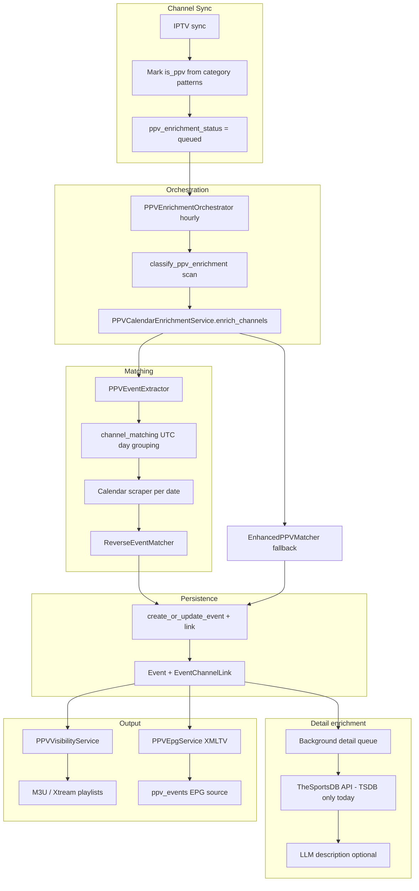

# PPV Pipeline and Module Map

**Audit:** PPV audit, June 2026  
**Status:** Draft for review

## Executive summary

PPV handling spans ~36 modules under `services/ppv/` plus reverse event matching, MLB Stats integration, team location registry, and EPG generation. The v2 calendar-based pipeline is functional but accumulated significant structural debt during MiLB/multi-source expansion: god classes, parallel detection modules, bypassed persistence, and stale documentation.

This document is the canonical module map. **`docs/PPV_ARCHITECTURE.md` should be updated to link here** once reviewed.

---

## End-to-end pipeline

---

## Module responsibilities

| Module | Role | Lines (approx) | Concerns |
|--------|------|----------------|----------|
| `orchestrator.py` | Scheduler/API entry, batch selection, enhanced fallback | 260 | Double classification (TODO 56) |
| `enrichment.py` | Calendar match pipeline, detail thread, stats, EPG hooks | 860 | God class (TODO 65) |
| `extraction.py` | Channel name → competitors, dates, sport hints | 850 | Monolith regex; stale docstring |
| `channel_matching.py` | UTC calendar day context for grouping | — | Untested (TODO 61) |
| `persistence.py` | Event + link CRUD, age validation | 210 | Bypassed by enrichment (TODO 54) |
| `detection.py` | PPV category/placeholder/generic detection | 60 | Duplicated in `epg/ppv.py` (TODO 53) |
| `enrichability.py` | Skip reason classification | 75 | Runs extract_all redundantly |
| `visibility.py` | Runtime hide/show PPV channels | — | OK |
| `epg.py` | XMLTV, event listing, EPG source sync | 620 | God class; split optional |
| `timezone_resolution.py` | Infer IANA TZ for unmatched channels | — | Sport key duplication (TODO 57) |
| `matching/enhanced.py` | Alternate matching pipeline | 690 | Overlaps calendar path |
| `matching/validation.py` | Post-match competitor checks | — | Diverges from reverse matcher (TODO 58) |
| `context/*` | Provider registry, assembler, LLM | — | Team lookup duplication |
| `cleanup.py` | Orphan event pruning | — | Side effect of enrichment |
| `preview.py` | Admin channel list API | — | Untested |

---

## External dependencies

| Package / service | Used for |
|-------------------|----------|
| `services/reverse_event_matcher/` | Calendar event → channel scoring |
| `services/thesportsdb_calendar_scraper.py` | TheSportsDB + MiLB calendar events |
| `services/mlb_stats_api.py` | MiLB schedule/detail |
| `services/team_location_registry.py` | fb/wnba/milb home timezones |
| `services/sportsipy_service.py` | Team metadata refresh |
| `data/team_locations/*.json` | Built by `scripts/build_team_locations.py` |

---

## Public API surface

**Documented exports** (`services/ppv/__init__.py`):

- `get_ppv_orchestrator`, `PPVVisibilityService`, `PPVEpgService`
- Detection helpers

**De facto internal imports** (should be formalized or documented):

- `services.ppv.matching.context`
- `services.ppv.channel_matching`
- `services.ppv.context.build_event_context`
- `services.ppv.persistence.persist_match`

---

## Status machine: `ppv_enrichment_status`

| Status | Meaning |
|--------|---------|
| `null` / `queued` | Awaiting enrichment |
| `retry_pending` | Transient failure; will retry |
| `matched` | Linked to `Event` |
| `no_match` | Processed; no calendar match |
| `skipped` | Permanent skip (placeholder, generic, far-future, etc.) |

Skip reasons stored in `ppv_enrichment_error` as `skip:<reason>`.

---

## Scheduler integration

- Hourly: `PPVEnrichmentOrchestrator.enrich_pending_channels`
- Calendar prefetch: `prefetch_calendars` via enhanced matcher
- Enhanced fallback: `run_enhanced_fallback` for `no_match` channels
- Team location refresh: separate jobs (sportsipy, MLB, football-data)

---

## Related TODOs

| Priority | TODO |
|----------|------|
| P0 | 52–55 |
| P1 | 56–62, 59 |
| P2 | 63, 66 |
| P3 | 64–67, 65 |

See also: `ppv-matching-strategies.md`, `ppv-multi-source-events.md`, `ppv-module-coupling.md`, `ppv-documentation-gaps.md`.
