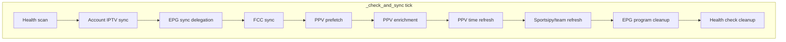
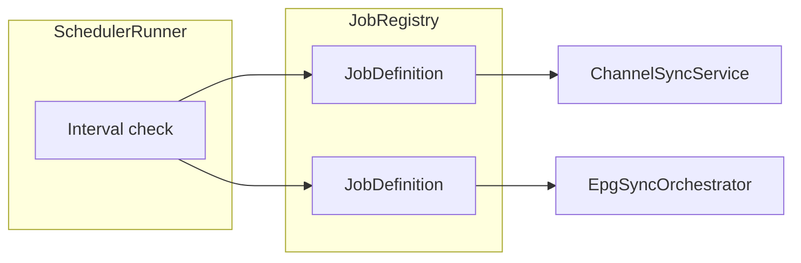

# Scheduler and Sync Orchestration

**Audit:** Application-wide audit, June 2026  
**Status:** Draft for review

## Overview

Background work is driven primarily by `SyncScheduler` — a single thread polling every N seconds, running jobs sequentially when intervals elapse.

## Known issues

| Issue | TODO |
|-------|------|
| Account sync marked success when `stats.success=False` | 71 ✅ |
| Job timestamps advance on failure | 71 ✅ |
| Status API lacks per-job failure metadata | 91 ✅ |
| Sequential blocking (slow EPG blocks PPV) | 89 |
| God class (~676 lines) | 89 |
| Global vs per-source EPG `last_sync` dual tracking | 90 |

## Sync lock patterns

Account sync and EPG source sync each implement:

- Atomic `sync_in_progress` flag
- Stale lock recovery with cutoff timestamp

Duplicated between `sync_service.py` and `epg_sync_orchestrator.py` — consolidate (TODO 76).

## Post-sync side effects (IPTV sync)

`ChannelSyncService.sync_account` inline triggers:

1. Filter recompute → updates `is_visible`
2. PPV re-enrichment queue
3. Backup pair detection
4. PPV state resets

**Problem:** Sync latency and failure modes depend on PPV/filter subsystems. Tests must mock heavily.

**Target:** Event queue or scheduler sub-jobs (TODO 90).

## EPG sync (separate orchestrator)

`EpgSyncOrchestrator` handles per-source sync with progress tracking — better failure semantics after TODOs 40–43. Scheduler delegates via `_sync_epg_sources_if_due()`.

## Recommended target architecture

Each job: `{ key, interval, fn, advance_on_success: bool }`

## Related TODOs

- **71**, **76**, **89**, **90**
- Completed: **40–43** (EPG failure semantics)
