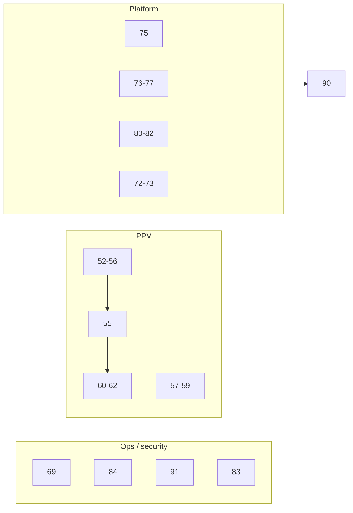

# Post-audit implementation roadmap

**Last updated:** June 2026  
**Companion:** [README.md](./README.md) (per-item specs), [../architecture/](../architecture/) (design notes)

This document groups open TODOs into execution **waves** and suggested **PR batches**. Individual acceptance criteria and test plans remain in each TODO file — implement from those, not from this summary alone.

## Status snapshot

| Track | Range | Open | Notes |
|-------|-------|------|-------|
| P5 — PPV | 52–67, **102** | **0** | Waves 2–3 + 7 ✅; **65** phases 1–3 ✅ |
| P6 — App-wide | 68–95 | **0** (parent stubs **78**, **85**, **92**, **95**) | Waves 1–8 phase 1 ✅ |
| **Wave 9** | 96–100 | **5** | Route splits, frontend ESM, parallel pytest |
| **Wave 10** | 101 | **1** | Final doc review (after Wave 9) |
| **Wave 9 (cont.)** | 102 | **0** | PPV `epg/` / `extraction/` package splits (PR **AA**) |

**Total open (required):** 6 (TODOs 96–101). **102** complete in Wave 9 batch **AA**.

Waves **1–7** ✅. Wave **8** phase 1 ✅ (PRs #35–38: TODOs 65, 66, 78 phase 1, 79). Remaining structural work is **Wave 9** → **Wave 10**.

Update [README.md](./README.md) status columns as work lands. Mark PR IDs in each TODO’s **Completion** section.

---

## How to use this roadmap

1. Work **wave by wave** unless a hotfix overrides order.
2. Prefer **one PR batch at a time**; do not combine migration PRs with god-class refactors.
3. Read the linked TODO doc(s) before coding.
4. Run each TODO’s test plan; add regression tests when the doc asks for them.
5. After merge, mark ✅ in README and note the PR in the TODO file.

---

## Cross-track dependency rules

| Rule | Rationale |
|------|-----------|
| **55 before 62** | MiLB E2E needs composite `(external_id, source)` |
| **54 before 60** | Persistence tests assume unified `persist_match` path |
| **53 before 64** | Detection test dedup after module unification |
| **57 before 58** | Team validation consumes sport registry |
| **72 before 73** (or one PR) | Error handling before response envelope changes |
| **83 before 85** | XSS audit defines escaping patterns for dedup/ESM |
| **76 before 90** | EPG sync dedup before programs split/decouple |
| **80 before 81** | Test DB parity before FK migration alignment |
| **91 before 89** (recommended) | Failure metadata API before scheduler registry refactor |
| **Waves 2–3 before 65/66** | God-class split and detail-thread work need stable PPV behavior |

**Do not batch in one effort:** 55 + 65 + 89 + 90 + 78 (migration + three large splits + route extraction).

---

## Wave 1 — Operator safety and quick route wins

**Goal:** Reduce blast radius behind Traefik/Authentik; fix surprising HTTP semantics.  
**Est. effort:** 1–2 weeks

| Order | TODO | Summary |
|-------|------|---------|
| 1a | [69](./69-lock-down-destructive-admin-endpoints.md) | FCC DROP TABLE off HTTP; SSRF hardening; import validation |
| 1b | [84](./84-docker-and-secrets-hardening.md) | `.dockerignore`, secrets, non-root container |
| 1c | [75](./75-fix-side-effect-get-account-categories.md) | GET categories must not call upstream IPTV |
| 1d | [74](./74-remove-dead-routes-and-dangerous-patterns.md) | Dead blueprint, duplicate FCC/categories endpoints |

### PR batches — Wave 1

| PR | TODOs | Theme | Size |
|----|-------|-------|------|
| **A** | 69, 84 | Security + deploy hygiene | S–M |
| **B** | 75, 74 | Safe HTTP / route cleanup | M |

---

## Wave 2 — PPV correctness foundation

**Goal:** Correct metrics, unified persistence, multi-source events, less duplicate work.  
**Est. effort:** 2–3 weeks  
**Highest product impact** in the open backlog.

```text
52 → 54 → 55 → 53
         ↘ 56 (after 54; can overlap 53 carefully)
57 → 58
59 (after 54/55)
```

| Order | TODO | Priority | Summary |
|-------|------|----------|---------|
| 2a | [52](./52-fix-details-fetched-stat.md) | P0 | Increment `details_fetched` stat |
| 2b | [54](./54-route-enrichment-through-persist-match.md) | P0 | Calendar path through `persist_match` |
| 2c | [55](./55-multi-source-events-schema-and-detail-fetch.md) | P0 | Composite unique; source-aware detail fetch |
| 2d | [53](./53-unify-ppv-detection-modules.md) | P0 | Single detection module |
| 2e | [56](./56-eliminate-double-enrichment-classification.md) | P1 | No double classify + extract per channel |
| 2f | [57](./57-centralize-sport-key-mappings.md) | P1 | Central sport registry |
| 2g | [58](./58-fix-team-resolution-and-validation.md) | P1 | Team matching + WNBA, etc. |
| 2h | [59](./59-harden-ppv-enrichment-routes.md) | P1 | Route errors, memory, queue logging |

**Architecture review before large edits:** [ppv-multi-source-events.md](../architecture/ppv-multi-source-events.md), [ppv-pipeline-and-module-map.md](../architecture/ppv-pipeline-and-module-map.md), [ppv-sport-registry.md](../architecture/ppv-sport-registry.md)

### PR batches — Wave 2

| PR | TODOs | Theme | Size |
|----|-------|-------|------|
| **C** | 52, 54 | Metrics + unified persistence | S |
| **D** | 55 | Multi-source migration + detail branching | **L** |
| **E** | 53, 56 | Detection unify + no double classification | M |
| **F** | 57, 58 | Sport registry + team validation | M |
| **G** | 59 | PPV route hardening | S–M |

---

## Wave 3 — PPV tests (lock behavior before refactors)

**Goal:** Regression safety before TODOs 65–66.  
**Depends on:** Wave 2 (especially 54, 55, 53)

| Order | TODO | Depends on | Summary |
|-------|------|------------|---------|
| 3a | [60](./60-add-persistence-unit-tests.md) | 54 | `persistence.py` unit tests |
| 3b | [61](./61-add-channel-matching-tests.md) | — | UTC calendar-day grouping tests |
| 3c | [62](./62-add-milb-ppv-integration-test.md) | 55 | MiLB channel → Event E2E |
| 3c′ | [94](./94-speed-up-thesportsdb-tests-no-live-http.md) | — | TheSportsDB unit tests: patch `call_thesportsdb_api` (ships with PR **I**) ✅ |
| 3d | [64](./64-consolidate-ppv-detection-tests.md) | 53 | Dedupe detection test modules |
| 3e | [63](./63-expand-ppv-test-coverage.md) | 52–59 stable | Orchestrator, cleanup, providers |

### PR batches — Wave 3

| PR | TODOs | Theme | Size |
|----|-------|-------|------|
| **H** | 60, 61 | PPV unit tests | S |
| **I** | 62, 94 | MiLB E2E + TheSportsDB test mocks (no live HTTP) | M |
| **J** | 64, 63 | Test dedup + expansion | M–L (split 63 if needed) |

---

## Wave 4 — Scheduler and EPG infrastructure

**Goal:** Observable failures, less duplicated sync infrastructure.  
**Builds on:** [71](./71-fix-scheduler-sync-status-semantics.md) ✅

| Order | TODO | Summary |
|-------|------|---------|
| 4a | [91](./91-scheduler-status-api-failure-metadata.md) | Per-job failure fields in status API + SyncMetadata |
| 4b | [76](./76-deduplicate-epg-sync-infrastructure.md) | Program persistence, sync locks, shared constants |
| 4c | [77](./77-centralize-tag-loading-and-category-sync-policy.md) | Tag loader N+1; category sync failure policy |
| 4d | [89](./89-refactor-scheduler-job-registry.md) | Scheduler job registry (large) ✅ |
| 4e | [90](./90-split-epg-programs-and-decouple-sync.md) | Split `programs.py`; decouple sync side effects |

**Architecture:** [scheduler-and-sync-orchestration.md](../architecture/scheduler-and-sync-orchestration.md), [epg-service-architecture.md](../architecture/epg-service-architecture.md)

### PR batches — Wave 4

| PR | TODOs | Theme | Size |
|----|-------|-------|------|
| **K** | 91 | Scheduler failure metadata API | M |
| **L** | 76 | EPG sync dedup | M |
| **M** | 77 | Tag loading + category policy | M |
| **N** | 89 | Scheduler registry refactor | **L** |
| **O** | 90 | EPG programs split + decouple | **L** |

---

## Wave 5 — API contract and database parity

**Goal:** Consistent JSON errors/responses; tests match production schema.  
**Note:** 72–73 may require coordinated frontend updates.

| Order | TODO | Summary |
|-------|------|---------|
| 5a | [72](./72-standardize-api-error-handling.md) | `@handle_errors` coverage |
| 5b | [73](./73-standardize-api-response-shapes.md) | Success/error envelopes |
| 5c | [79](./79-extract-shared-route-serializers.md) | Shared serializers (feeds route splits) |
| 5d | [80](./80-align-test-db-with-production-schema.md) | pytest DB vs migrations |
| 5e | [81](./81-model-fk-ondelete-alignment.md) | FK `ondelete` alignment |
| 5f | [82](./82-scheduled-data-retention.md) | Events + image cache retention |

**Architecture:** [api-contract-errors-and-responses.md](../architecture/api-contract-errors-and-responses.md), [schema-lifecycle-and-test-parity.md](../architecture/schema-lifecycle-and-test-parity.md)

### PR batches — Wave 5

| PR | TODOs | Theme | Size |
|----|-------|-------|------|
| **P** | 72, 73 | API contract (coordinate admin JS) | M (breaking) |
| **Q** | 80, 81 | Schema test parity + FK alignment | M |
| **R** | 82 | Data retention | M |
| — | 79 | Serializers (optional with Wave 8 **78**) | M |

---

## Wave 6 — Frontend safety and smoke tests

**Goal:** XSS reduction; shared helpers; basic admin page coverage.

| Order | TODO | Summary |
|-------|------|---------|
| 6a | [83](./83-xss-audit-legacy-frontend.md) | innerHTML / API data audit |
| 6b | [85](./85-frontend-deduplication-and-esm-migration.md) | escapeHtml, ESM migration |
| 6c | [86](./86-web-smoke-tests-and-pytest-consolidation.md) | Admin smoke tests; fixture dedup |

**Architecture:** [frontend-architecture-debt.md](../architecture/frontend-architecture-debt.md)

### PR batches — Wave 6

| PR | TODOs | Theme | Size |
|----|-------|-------|------|
| **S** | 83 | XSS audit + fixes | M |
| **T** | 85 | Frontend dedup + ESM | M |
| **U** | 86 | Web smoke + pytest consolidation | M |

---

## Wave 7 — DX, documentation, CI ✅

**Goal:** Docs match reality; stronger CI after test stability.  
**Completed:** PR #34 (TODOs 87, 88, 67).

| TODO | Summary |
|------|---------|
| [87](./87-fix-stale-documentation.md) ✅ | API_REFERENCE, missing P4 links, P6 summary drift |
| [88](./88-expand-ci-quality-gates.md) ✅ | vulture, Docker PR build, pre-commit |
| [67](./67-ppv-misc-cleanup.md) ✅ | Constants, heuristics, docstrings |

---

## Wave 8 — Large structural refactors (phase 1) ✅

**Goal:** Maintainability; **one TODO per PR**, dedicated review time.  
**Completed:** PRs #35–38 (June 2026).

| TODO | PR | Outcome |
|------|-----|---------|
| [65](./65-refactor-enrichment-god-class.md) phase 1 | #35 | `enrichment/` package split |
| [66](./66-detail-thread-and-epg-side-effect-decoupling.md) | #37 | Detail thread + EPG hooks decoupled |
| [78](./78-split-fat-route-modules.md) phase 1 | #36 | `AccountAdminService`; `accounts.py` −32% |
| [79](./79-extract-shared-route-serializers.md) | #38 | Shared serializers + schema validation |

**Remaining from Wave 8 parents:** continued in **Wave 9** (96–98, 99, 102). See parent TODOs 78, 85, 65.

---

## Wave 9 — Completion and follow-ups

**Goal:** Finish phased route splits, frontend ESM migration, test parallelization, and CDN hardening.  
**Est. effort:** 2–3 weeks  
**Prerequisites:** Wave 8 phase 1 ✅; Waves 2–3 PPV ✅; TODO 79 ✅; TODO 83 ✅.

```text
W: 96 → 97
X: 98 (after W recommended)
Y: 99 (parallel with W/X if separate contributor)
Z: 100 (last — stable suite before xdist CI)
AA: 102 (PPV module splits — 65 phases 2–3)
```

| Order | TODO | Parent | Summary |
|-------|------|--------|---------|
| 9a | [96](./96-extract-epg-match-rules-routes.md) | 78 phase 2 | Extract `routes/epg/match_rules.py` |
| 9b | [97](./97-extract-config-transfer-routes.md) | 78 phase 3 | Extract `routes/config_transfer.py` |
| 9c | [98](./98-fcc-patterns-split-and-cdn-sri.md) | 78 phase 4 + 92 | FCC routes + CDN SRI |
| 9d | [99](./99-esm-tab-migration-and-eslint.md) | 85 phases 2–3 | ESM tabs 1–3 ✅ PR #40 |
| 9e | [103](./103-esm-tabs-4-6-migration.md) | 85 phase 3 | ESM tabs 4–6 + ESLint |
| 9e | [100](./100-parallelize-pytest-xdist.md) | 95 | pytest-xdist per-worker DB |
| 9f | [102](./102-optional-ppv-module-splits.md) | 65 phases 2–3 | Split `epg.py`, `extraction.py` |

### PR batches — Wave 9

| PR | TODOs | Theme | Size |
|----|-------|-------|------|
| **W** | 96, 97 | Route splits: match_rules + config_transfer | M (split 2 PRs) |
| **X** | 98 | FCC patterns split + CDN SRI | M |
| **Y** | 99, 103 | ESM tab migration + ESLint | M–L (multi-PR OK) |
| **Z** | 100 | Parallel pytest (pytest-xdist) | M |
| **AA** | 102 | PPV module splits (`epg/`, `extraction/`) | L |

**Suggested merge order:** **W** (96 → 97) → **X** → **Y** (can overlap **W**/**X**) → **Z** → **AA** if scheduled → then Wave 10.

---

## Wave 10 — Final documentation review

**Goal:** Single doc sync after Wave 9 code lands — no new features.  
**Gate:** Run [101](./101-final-documentation-review.md) **after** batches **W–Z** merge (and **AA** if done).

| TODO | Summary |
|------|---------|
| [101](./101-final-documentation-review.md) | README, ROADMAP, API_REFERENCE, DEVELOPER_GUIDE, TODO index, Completion links |

Closes residual drift from ongoing wave merges (extends [87](./87-fix-stale-documentation.md) ✅).

---

## Master PR batch index

Quick reference for all suggested pull requests (A–AA + Wave 8 singles).

| PR | Wave | TODOs | Size | Status |
|----|------|-------|------|--------|
| A | 1 | 69, 84 | S–M | ✅ #10, #17 |
| B | 1 | 75, 74 | M | ✅ #11 |
| C | 2 | 52, 54 | S | ✅ #12 |
| D | 2 | 55 | **L** | ✅ #13 |
| E | 2 | 53, 56 | M | ✅ #14 |
| F | 2 | 57, 58 | M | ✅ #15 |
| G | 2 | 59 | S–M | ✅ #16 |
| H | 3 | 60, 61 | S | ✅ #19 |
| I | 3 | 62, 94 | M | ✅ #20, #27 |
| J | 3 | 64, 63 | M–L | ✅ #21 |
| K | 4 | 91 | M | ✅ #22 |
| L | 4 | 76 | M | ✅ #23 |
| M | 4 | 77 | M | ✅ #24 |
| N | 4 | 89 | **L** | ✅ #25 |
| O | 4 | 90 | **L** | ✅ #26 |
| P | 5 | 72, 73 | M | ✅ #30 |
| Q | 5 | 80, 81 | M | ✅ #29 |
| R | 5 | 82 | M | ✅ #28 |
| S | 6 | 83 | M | ✅ #32 |
| T | 6 | 85 phase 1 | M | ✅ #33 |
| U | 6 | 86 | M | ✅ #31 |
| V | 7 | 87, 88, 67 | M | ✅ #34 |
| — | 8 | 65 phase 1 | **L** | ✅ #35 |
| — | 8 | 66 | M | ✅ #37 |
| — | 8 | 78 phase 1 | **L** | ✅ #36 |
| — | 8 | 79 | M | ✅ #38 |
| **W** | 9 | 96, 97 | M | ⬜ |
| **X** | 9 | 98 | M | 🟡 PR open |
| **Y** | 9 | 99 | M–L | ✅ PR #40 |
| **Y** | 9 | 103 | M | 🟡 PR pending |
| **Z** | 9 | 100 | M | ⬜ |
| **AA** | 9 | 102 | L | ✅ |
| — | 10 | 101 | S | ⬜ after Wave 9 |

**Size legend:** S = small (1–2 days), M = medium (3–5 days), L = large (1+ week, migration or major refactor).

---

## Parallel workstreams (two contributors)



| Contributor | Suggested track |
|-------------|-----------------|
| **A** | Wave 1 → Wave 4 (K, L, M) → Wave 5 (Q) |
| **B** | Wave 2 → Wave 3 → Wave 8 (65–66) when stable |

Wave 6 (83–86) fits either track after Wave 1 or 5.

---

## Recommended “next five” (Wave 9)

If resuming after Waves 1–8:

1. **[96](./96-extract-epg-match-rules-routes.md)** — match_rules route split (PR **W**, first)  
2. **[97](./97-extract-config-transfer-routes.md)** — config transfer split (PR **W**, second)  
3. **[98](./98-fcc-patterns-split-and-cdn-sri.md)** — FCC + CDN SRI (PR **X**)  
4. **[99](./99-esm-tab-migration-and-eslint.md)** — ESM tabs + ESLint (PR **Y**; can parallelize with W/X)  
5. **[100](./100-parallelize-pytest-xdist.md)** — pytest-xdist (PR **Z**; after suite stable)  

Then **[101](./101-final-documentation-review.md)** (Wave 10). **[102](./102-optional-ppv-module-splits.md)** (PR **AA**) complete — PPV `epg/` and `extraction/` package splits.

---

## Completed prerequisites (do not re-do)

These closed items underpin the open work:

| Area | Done TODOs |
|------|------------|
| Channel selection parity | 01–08, 17–21 |
| EPG sync orchestration | 40–51 |
| `is_visible` / admin semantics | 27, 70 |
| Scheduler timestamps / account status | 71 |
| Proxy auth documentation | 68, [DEPLOYMENT.md](../DEPLOYMENT.md) |
| DB hardening baseline | 35–39 |

---

## Deferred or low urgency

| TODO | Defer until |
|------|-------------|
| 102 | ✅ Complete (Wave 9 batch **AA**) |
| 101 | All Wave 9 implementation PRs merged |
| Parent 92, 95 | Use focused TODOs 98, 100 instead |

---

## Maintenance

When a wave completes:

1. Update statuses in [README.md](./README.md).  
2. Add PR links under **Completion** in each TODO file.  
3. Refresh the snapshot table at the top of this file if counts change.  
4. Fix [87](./87-fix-stale-documentation.md) if the README and this roadmap diverge.
