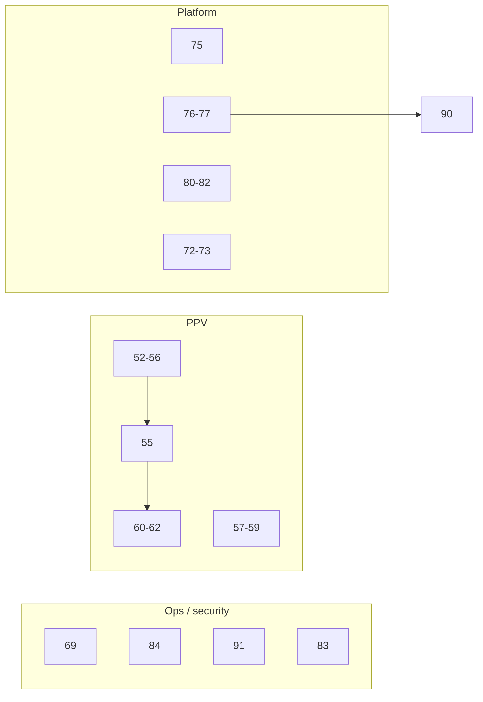

# Post-audit implementation roadmap

**Last updated:** June 2026  
**Companion:** [README.md](./README.md) (per-item specs), [../architecture/](../architecture/) (design notes)

This document groups **36 open TODOs** into execution **waves** and suggested **PR batches**. Individual acceptance criteria and test plans remain in each TODO file — implement from those, not from this summary alone.

## Status snapshot

| Track | Range | Open | Recently completed |
|-------|-------|------|-------------------|
| P5 — PPV | 52–67 | 16 | — |
| P6 — App-wide | 68–94 | 19 | 68, 69, 70, 71, 74, 75, 84 |

Update [README.md](./README.md) status columns as work lands. Mark PR IDs in each TODO’s **Completion** section.

---

## How to use this roadmap

1. Work **wave by wave** unless a hotfix overrides order.
2. Prefer **one PR batch at a time**; do not combine migration PRs with god-class refactors.
3. Read the linked TODO doc(s) before coding.
4. Run each TODO’s test plan; add regression tests when the doc asks for them.
5. After merge, mark ✅ in README and note the PR in the TODO file.

---

## Cross-track dependency rules

| Rule | Rationale |
|------|-----------|
| **55 before 62** | MiLB E2E needs composite `(external_id, source)` |
| **54 before 60** | Persistence tests assume unified `persist_match` path |
| **53 before 64** | Detection test dedup after module unification |
| **57 before 58** | Team validation consumes sport registry |
| **72 before 73** (or one PR) | Error handling before response envelope changes |
| **83 before 85** | XSS audit defines escaping patterns for dedup/ESM |
| **76 before 90** | EPG sync dedup before programs split/decouple |
| **80 before 81** | Test DB parity before FK migration alignment |
| **91 before 89** (recommended) | Failure metadata API before scheduler registry refactor |
| **Waves 2–3 before 65/66** | God-class split and detail-thread work need stable PPV behavior |

**Do not batch in one effort:** 55 + 65 + 89 + 90 + 78 (migration + three large splits + route extraction).

---

## Wave 1 — Operator safety and quick route wins

**Goal:** Reduce blast radius behind Traefik/Authentik; fix surprising HTTP semantics.  
**Est. effort:** 1–2 weeks

| Order | TODO | Summary |
|-------|------|---------|
| 1a | [69](./69-lock-down-destructive-admin-endpoints.md) | FCC DROP TABLE off HTTP; SSRF hardening; import validation |
| 1b | [84](./84-docker-and-secrets-hardening.md) | `.dockerignore`, secrets, non-root container |
| 1c | [75](./75-fix-side-effect-get-account-categories.md) | GET categories must not call upstream IPTV |
| 1d | [74](./74-remove-dead-routes-and-dangerous-patterns.md) | Dead blueprint, duplicate FCC/categories endpoints |

### PR batches — Wave 1

| PR | TODOs | Theme | Size |
|----|-------|-------|------|
| **A** | 69, 84 | Security + deploy hygiene | S–M |
| **B** | 75, 74 | Safe HTTP / route cleanup | M |

---

## Wave 2 — PPV correctness foundation

**Goal:** Correct metrics, unified persistence, multi-source events, less duplicate work.  
**Est. effort:** 2–3 weeks  
**Highest product impact** in the open backlog.

```text
52 → 54 → 55 → 53
         ↘ 56 (after 54; can overlap 53 carefully)
57 → 58
59 (after 54/55)
```

| Order | TODO | Priority | Summary |
|-------|------|----------|---------|
| 2a | [52](./52-fix-details-fetched-stat.md) | P0 | Increment `details_fetched` stat |
| 2b | [54](./54-route-enrichment-through-persist-match.md) | P0 | Calendar path through `persist_match` |
| 2c | [55](./55-multi-source-events-schema-and-detail-fetch.md) | P0 | Composite unique; source-aware detail fetch |
| 2d | [53](./53-unify-ppv-detection-modules.md) | P0 | Single detection module |
| 2e | [56](./56-eliminate-double-enrichment-classification.md) | P1 | No double classify + extract per channel |
| 2f | [57](./57-centralize-sport-key-mappings.md) | P1 | Central sport registry |
| 2g | [58](./58-fix-team-resolution-and-validation.md) | P1 | Team matching + WNBA, etc. |
| 2h | [59](./59-harden-ppv-enrichment-routes.md) | P1 | Route errors, memory, queue logging |

**Architecture review before large edits:** [ppv-multi-source-events.md](../architecture/ppv-multi-source-events.md), [ppv-pipeline-and-module-map.md](../architecture/ppv-pipeline-and-module-map.md), [ppv-sport-registry.md](../architecture/ppv-sport-registry.md)

### PR batches — Wave 2

| PR | TODOs | Theme | Size |
|----|-------|-------|------|
| **C** | 52, 54 | Metrics + unified persistence | S |
| **D** | 55 | Multi-source migration + detail branching | **L** |
| **E** | 53, 56 | Detection unify + no double classification | M |
| **F** | 57, 58 | Sport registry + team validation | M |
| **G** | 59 | PPV route hardening | S–M |

---

## Wave 3 — PPV tests (lock behavior before refactors)

**Goal:** Regression safety before TODOs 65–66.  
**Depends on:** Wave 2 (especially 54, 55, 53)

| Order | TODO | Depends on | Summary |
|-------|------|------------|---------|
| 3a | [60](./60-add-persistence-unit-tests.md) | 54 | `persistence.py` unit tests |
| 3b | [61](./61-add-channel-matching-tests.md) | — | UTC calendar-day grouping tests |
| 3c | [62](./62-add-milb-ppv-integration-test.md) | 55 | MiLB channel → Event E2E |
| 3d | [64](./64-consolidate-ppv-detection-tests.md) | 53 | Dedupe detection test modules |
| 3e | [63](./63-expand-ppv-test-coverage.md) | 52–59 stable | Orchestrator, cleanup, providers |

### PR batches — Wave 3

| PR | TODOs | Theme | Size |
|----|-------|-------|------|
| **H** | 60, 61 | PPV unit tests | S |
| **I** | 62 | MiLB E2E | M |
| **J** | 64, 63 | Test dedup + expansion | M–L (split 63 if needed) |

---

## Wave 4 — Scheduler and EPG infrastructure

**Goal:** Observable failures, less duplicated sync infrastructure.  
**Builds on:** [71](./71-fix-scheduler-sync-status-semantics.md) ✅

| Order | TODO | Summary |
|-------|------|---------|
| 4a | [91](./91-scheduler-status-api-failure-metadata.md) | Per-job failure fields in status API + SyncMetadata |
| 4b | [76](./76-deduplicate-epg-sync-infrastructure.md) | Program persistence, sync locks, shared constants |
| 4c | [77](./77-centralize-tag-loading-and-category-sync-policy.md) | Tag loader N+1; category sync failure policy |
| 4d | [89](./89-refactor-scheduler-job-registry.md) | Scheduler job registry (large) |
| 4e | [90](./90-split-epg-programs-and-decouple-sync.md) | Split `programs.py`; decouple sync side effects |

**Architecture:** [scheduler-and-sync-orchestration.md](../architecture/scheduler-and-sync-orchestration.md), [epg-service-architecture.md](../architecture/epg-service-architecture.md)

### PR batches — Wave 4

| PR | TODOs | Theme | Size |
|----|-------|-------|------|
| **K** | 91 | Scheduler failure metadata API | M |
| **L** | 76 | EPG sync dedup | M |
| **M** | 77 | Tag loading + category policy | M |
| **N** | 89 | Scheduler registry refactor | **L** |
| **O** | 90 | EPG programs split + decouple | **L** |

---

## Wave 5 — API contract and database parity

**Goal:** Consistent JSON errors/responses; tests match production schema.  
**Note:** 72–73 may require coordinated frontend updates.

| Order | TODO | Summary |
|-------|------|---------|
| 5a | [72](./72-standardize-api-error-handling.md) | `@handle_errors` coverage |
| 5b | [73](./73-standardize-api-response-shapes.md) | Success/error envelopes |
| 5c | [79](./79-extract-shared-route-serializers.md) | Shared serializers (feeds route splits) |
| 5d | [80](./80-align-test-db-with-production-schema.md) | pytest DB vs migrations |
| 5e | [81](./81-model-fk-ondelete-alignment.md) | FK `ondelete` alignment |
| 5f | [82](./82-scheduled-data-retention.md) | Events + image cache retention |

**Architecture:** [api-contract-errors-and-responses.md](../architecture/api-contract-errors-and-responses.md), [schema-lifecycle-and-test-parity.md](../architecture/schema-lifecycle-and-test-parity.md)

### PR batches — Wave 5

| PR | TODOs | Theme | Size |
|----|-------|-------|------|
| **P** | 72, 73 | API contract (coordinate admin JS) | M (breaking) |
| **Q** | 80, 81 | Schema test parity + FK alignment | M |
| **R** | 82 | Data retention | M |
| — | 79 | Serializers (optional with Wave 8 **78**) | M |

---

## Wave 6 — Frontend safety and smoke tests

**Goal:** XSS reduction; shared helpers; basic admin page coverage.

| Order | TODO | Summary |
|-------|------|---------|
| 6a | [83](./83-xss-audit-legacy-frontend.md) | innerHTML / API data audit |
| 6b | [85](./85-frontend-deduplication-and-esm-migration.md) | escapeHtml, ESM migration |
| 6c | [86](./86-web-smoke-tests-and-pytest-consolidation.md) | Admin smoke tests; fixture dedup |

**Architecture:** [frontend-architecture-debt.md](../architecture/frontend-architecture-debt.md)

### PR batches — Wave 6

| PR | TODOs | Theme | Size |
|----|-------|-------|------|
| **S** | 83 | XSS audit + fixes | M |
| **T** | 85 | Frontend dedup + ESM | M |
| **U** | 86 | Web smoke + pytest consolidation | M |

---

## Wave 7 — DX, documentation, CI

**Goal:** Docs match reality; stronger CI after test stability.

| TODO | When | Summary |
|------|------|---------|
| [94](./94-speed-up-thesportsdb-tests-no-live-http.md) | **Early** (quick win) | Stale SDK mocks → live retry sleeps; patch `call_thesportsdb_api` |
| [87](./87-fix-stale-documentation.md) | Early + after 72/73 | API_REFERENCE, missing P4 links, P6 summary drift |
| [88](./88-expand-ci-quality-gates.md) | After 80, 86, **94** | vulture, Docker PR build, pre-commit |
| [67](./67-ppv-misc-cleanup.md) | Anytime after Wave 2 | Constants, heuristics, docstrings |

### PR batches — Wave 7

| PR | TODOs | Theme | Size |
|----|-------|-------|------|
| **V** | 94 | TheSportsDB test mocks + no live HTTP | **S** |

Other Wave 7 items: small PRs or folded into related waves.

---

## Wave 8 — Large structural refactors

**Goal:** Maintainability; **one TODO per PR**, dedicated review time.  
**Prerequisites:** Waves 2–3 (PPV), Wave 5 (API/schema) where noted.

| TODO | Size | Prerequisite |
|------|------|--------------|
| [65](./65-refactor-enrichment-god-class.md) | L | Waves 2–3 |
| [66](./66-detail-thread-and-epg-side-effect-decoupling.md) | M | 65 |
| [78](./78-split-fat-route-modules.md) | L | 79, 72–73 helpful |
| [79](./79-extract-shared-route-serializers.md) | M | Can precede 78 |

Defer **64** until **53** if not done in Wave 3.

---

## Master PR batch index

Quick reference for all suggested pull requests (A–U + large singles).

| PR | Wave | TODOs | Size |
|----|------|-------|------|
| A | 1 | 69, 84 | S–M |
| B | 1 | 75, 74 | M |
| C | 2 | 52, 54 | S |
| D | 2 | 55 | **L** |
| E | 2 | 53, 56 | M |
| F | 2 | 57, 58 | M |
| G | 2 | 59 | S–M |
| H | 3 | 60, 61 | S |
| I | 3 | 62 | M |
| J | 3 | 64, 63 | M–L |
| K | 4 | 91 | M |
| L | 4 | 76 | M |
| M | 4 | 77 | M |
| N | 4 | 89 | **L** |
| O | 4 | 90 | **L** |
| P | 5 | 72, 73 | M |
| Q | 5 | 80, 81 | M |
| R | 5 | 82 | M |
| S | 6 | 83 | M |
| T | 6 | 85 | M |
| U | 6 | 86 | M |
| V | 7 | 94 | **S** |
| — | 8 | 65 | **L** |
| — | 8 | 66 | M |
| — | 8 | 79 | M |
| — | 8 | 78 | **L** |

**Size legend:** S = small (1–2 days), M = medium (3–5 days), L = large (1+ week, migration or major refactor).

---

## Parallel workstreams (two contributors)



| Contributor | Suggested track |
|-------------|-----------------|
| **A** | Wave 1 → Wave 4 (K, L, M) → Wave 5 (Q) |
| **B** | Wave 2 → Wave 3 → Wave 8 (65–66) when stable |

Wave 6 (83–86) fits either track after Wave 1 or 5.

---

## Recommended “next five” (starting point)

If resuming without a assigned wave:

1. **[94](./94-speed-up-thesportsdb-tests-no-live-http.md)** — ~5 min → under 30s for TheSportsDB tests; stops hammering live API (PR V)  
2. **[52](./52-fix-details-fetched-stat.md) + [54](./54-route-enrichment-through-persist-match.md)** — PPV metrics/persist (PR C)  
3. **[55](./55-multi-source-events-schema-and-detail-fetch.md)** — plan migration window (PR D)  
4. **[91](./91-scheduler-status-api-failure-metadata.md)** — scheduler failure visibility (PR K)  
5. **[76](./76-deduplicate-epg-sync-infrastructure.md)** — EPG sync dedup (PR L)  

---

## Completed prerequisites (do not re-do)

These closed items underpin the open work:

| Area | Done TODOs |
|------|------------|
| Channel selection parity | 01–08, 17–21 |
| EPG sync orchestration | 40–51 |
| `is_visible` / admin semantics | 27, 70 |
| Scheduler timestamps / account status | 71 |
| Proxy auth documentation | 68, [DEPLOYMENT.md](../DEPLOYMENT.md) |
| DB hardening baseline | 35–39 |

---

## Deferred or low urgency

| TODO | Defer until |
|------|-------------|
| 88 | 80, 86, **94** reduce CI flake |
| 94 | None — do early for faster local/CI runs |
| 78 | 79 + 72/73 |
| 65, 89, 90 | Dedicated milestones after waves 2–4 |
| 64 | 53 merged |
| 67 | Filler between PRs |

---

## Maintenance

When a wave completes:

1. Update statuses in [README.md](./README.md).  
2. Add PR links under **Completion** in each TODO file.  
3. Refresh the snapshot table at the top of this file if counts change.  
4. Fix [87](./87-fix-stale-documentation.md) if the README and this roadmap diverge.
